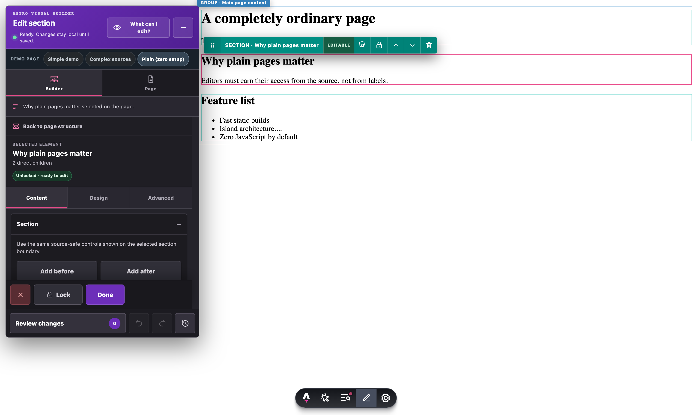
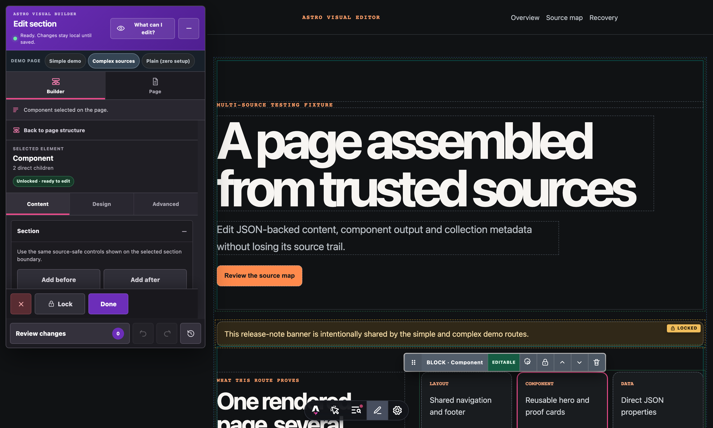
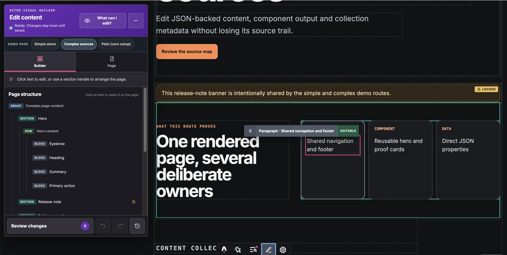
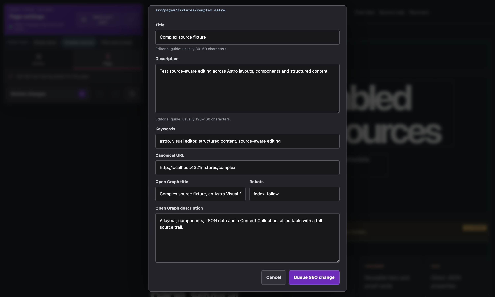
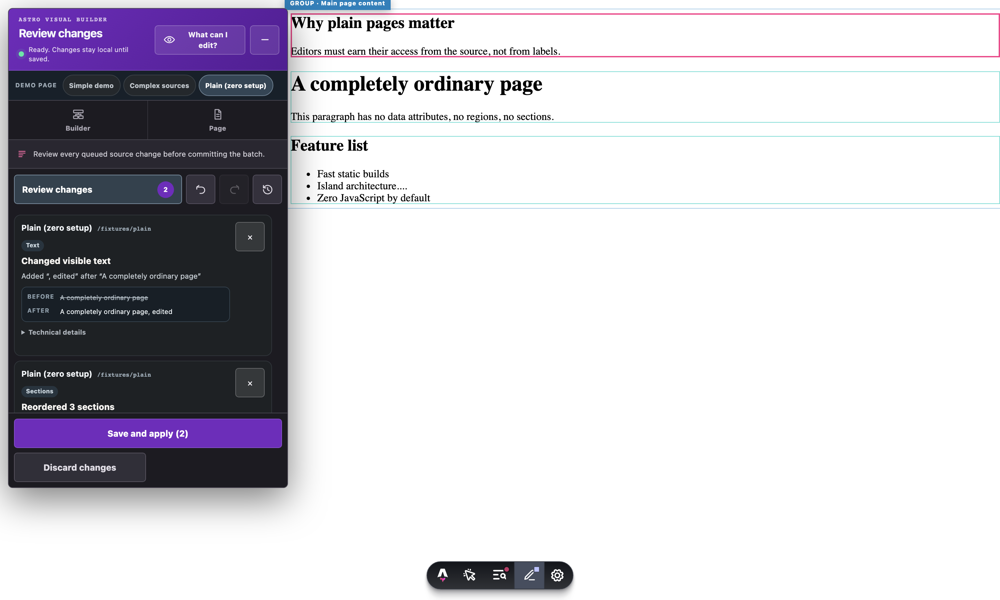

# Astro Visual Editor: Change Text, SEO & Drag & Drop Sections in the Front-End


Edit an Astro site where it renders. Queue text, SEO and section changes,
review the complete batch, then write validated source updates through Astro's
development toolbar.

[](https://github.com/OpaceDigitalAgency/astro-visual-editor/actions/workflows/ci.yml)
[](https://opace.agency/tools/astro/visual-editor/)
[](https://www.npmjs.com/package/@opacedev/astro-visual-editor)
[](./LICENSE)
[](https://docs.astro.build/en/guides/integrations/)

[Product page](https://opace.agency/tools/astro/visual-editor/) ·
[Install](#install) · [Try the demo](#try-the-repository-demo) ·
[How this compares](#how-this-compares) ·
[Configuration](#configuration) · [Security](./SECURITY.md) ·
[Contributing](./CONTRIBUTING.md) ·
[Opace open-source portfolio](https://github.com/OpaceDigitalAgency/OpaceDigitalAgency)

Astro Visual Editor is a reusable, development-only Astro integration for
reviewing and applying source-aware content changes from the rendered page.

It is created and maintained by Opace Digital Agency's <a href="https://opace.agency/services/web-design/astro-development/">Astro development team</a>. If you need
a wider website project, see the <a href="https://opace.agency/services/web-design/">web design services</a> provided by Opace or <a href="https://opace.agency/get-in-touch/">get in touch</a>.

> **Release status:** install the current published version from npm. The
> [changelog](./CHANGELOG.md) records released changes.

| At a glance     | Behaviour                                                                      |
| --------------- | ------------------------------------------------------------------------------ |
| Editing surface | A Divi/Elementor-style inspector docked beside the rendered page               |
| Content         | Discovered or mapped Astro/Markdown, JSON/JSONC and YAML values                |
| Page structure  | See and reorder declared Astro children or complete JSON/YAML arrays safely    |
| Changes         | One mixed text, SEO and section tray with undo, redo, save and guarded restore |
| Safety boundary | Local development only; no editor client or write endpoint in production       |

## See it in action

**Zero-setup editing.** A completely plain Astro page — no data attributes, no
regions, no configuration — with sections auto-inferred, one selected and its
full toolbar and inspector open:



**Progressive-disclosure builder.** The rendered page stays quiet until you
interact: faint boundaries at rest, one labelled tag on hover, one full
toolbar on the selected block. Locked content shows a persistent lock chip
with a one-click explanation:



**Page structure navigator.** Every group, section, row and block on the
page, Elementor-style: click any item to select and scroll to it on the
canvas, drag or use move controls to reorder, and see lock state at a
glance without opening the rendered page's own toolbar:



**SEO editing.** Title, description, keywords, canonical URL, Open Graph
fields and robots directives in one form, each field capability-checked
against its real source before it is offered:



**Reviewable changes.** Every text, SEO and structural edit lands in one
ledger with plain-language before/after summaries; nothing touches source
until you save the reviewed batch:



## What it does

- Work with zero setup on conventional Astro sites: enable the editor on an
  unannotated page and text with a single literal source occurrence becomes
  editable immediately, while safe structural matches become live
  drag-reorderable sections — no labels, no mappings, no policy required.
- Click rendered text and preview a replacement in place, or double-click to
  type directly on the page (Enter keeps it, Escape restores the original).
- See the whole page hierarchy — groups, rows, sections and blocks with their
  lock states — in a **Page structure** tree, Elementor-style: click to select
  and scroll to any item, or reorder it with the tree's own move controls.
- Keep the rendered page clean while editing: faint boundaries at rest, one
  labelled action bar on hover, one full toolbar on the selected element, and
  a landing-edge preview that shows which side a dragged block will drop on.
- Click an element or section directly. Use one-click **Lock** and **Unlock**
  without opening a separate permission screen.
- Edit title, description, keywords, canonical URL, Open Graph fields and
  robots directives in one SEO form.
- Add, delete or reorder supported source-owned sections immediately.
- Reorder with real pointer drag-and-drop, move buttons or keyboard controls.
- Add sections from a reusable template registry.
- Queue mixed text, SEO and structural changes in one visible ledger.
- Undo and redo queued operations, remove individual changes or clear the batch.
- Commit a validated batch and revert the last committed batch from its receipt.
- Recover queued and in-flight work across Astro HMR and navigation.
- Keep queues and responses isolated between multiple browser tabs.
- Provide a compact touch Pick mode on narrow screens.
- Distinguish hierarchy independently from permission: blue groups, teal
  sections and neutral elements, with visible Editable, Locked and Protected
  text states.
- Persist owner locks in a Git-reviewable project manifest after server-side
  diff and conflict validation.

The old editor documented drag-and-drop but only implemented up/down buttons.
This package provides both genuine drag-and-drop and accessible button/keyboard
alternatives.

The visual builder uses a familiar purple inspector with **Builder** and
**Page** tabs. The page makes room for the inspector on
desktop rather than hiding it over the content. Enabling the editor adds
an immediately readable hierarchy: blue named groups, teal named sections and
neutral content elements. Persistent handles name every section and state
badges say **Editable**, **Locked** or **Protected** without relying on colour.
Source-owned rows and blocks expose persistent drag dots; clicking the dots
expands a Divi-style contextual toolbar with settings, move, lock and delete.
Add before
and Add after remain in the section inspector. The inspector can be collapsed to a
compact picker on desktop or mobile. Icon controls expose visible hover/focus
tooltips and accessible names, and dialogs close through Cancel, Escape or a
click on the backdrop.

Selecting desktop content now keeps the exact element outlined and changes the
inspector title to **Edit heading**, **Edit paragraph** or the matching element
type. Its stable **Content / Design / Advanced** settings follow the familiar
Divi/Elementor model: typing in Content previews and auto-queues the value,
Design reports the
actual rendered typography and spacing, and Advanced identifies its source
file, structured field and page selector. Section, row and block selection uses
the same inspector contract alongside contextual move, drag and delete tools.
Style values remain read-only when the owning CSS or Astro style source cannot
be proven safely; the editor labels that boundary instead of offering a control
that cannot persist.

The familiar presentation does not weaken the source boundary: **Review
changes** can expose the mixed change ledger, while **Save and apply** always
performs the exact source-diff safety check before anything is written,
and the existing policy engine, undo, redo, history, safe retry and restore
capabilities remain available.

If validation refuses a batch, the editor keeps the complete local draft and
uses plain-language recovery copy. When the server can identify one failing
change, **Keep editing** leaves the batch untouched and **Save the rest** writes
only the independently valid changes, then returns the failed item to the local
change tray so it is not lost.

## Source-write safety

This package provides:

- runtime-validated, size-bounded toolbar messages;
- stable tab and request IDs with response filtering;
- idempotent save receipts and safe retries;
- project-root, source-root, extension and symlink-escape enforcement;
- original-file hashes and stale-source rejection;
- Astro compiler validation before `.astro` writes;
- structured JSON/JSONC and YAML property-path updates;
- Markdown/MDX frontmatter updates;
- fail-closed ambiguity and section-region checks;
- atomic per-file writes with best-effort batch rollback;
- receipt-backed revert that refuses to overwrite newer file changes;
- source writes disabled on network-exposed dev servers unless explicitly
  enabled.

It adds no production route, editor client or public write endpoint.

## How this compares

Most "Astro CMS" tools solve a different problem: they give a hosted or
admin-panel UI for editing structured content records (Keystatic, Sitepins,
Writenex, Sveltia, Decap), or overlay a hosted headless CMS on top of a live
preview (Sanity, Netlify Visual Editor, TinaCMS). None of them write directly
to `.astro` source, and most need an external account or hosting.

The closest actual peer is [Stacki](https://github.com/flowtricks/stacki), a
free, open-source **desktop app** that also edits Astro projects locally with
no CMS backend. It reaches that goal through a different mechanism: a
component/props palette in a separate Electron app, rather than click-any-
rendered-text editing inside Astro's own Dev Toolbar. Stacki currently ships
a visual style panel that this package does not yet have — see
[Roadmap](#roadmap-and-requests).

|                                      | This package                                          | Stacki                      | Headless-CMS tools (Keystatic, Sitepins, TinaCMS, …) |
| ------------------------------------ | ----------------------------------------------------- | --------------------------- | ---------------------------------------------------- |
| Where you edit                       | In-browser, on the rendered page, via the Dev Toolbar | Separate desktop app        | Separate admin UI or hosted studio                   |
| Writes to `.astro` source directly   | Yes                                                   | Yes, via its own page model | No — content records only                            |
| Zero-config on an unannotated page   | Yes                                                   | No                          | No                                                   |
| Style/design editing                 | Not yet (roadmap)                                     | Yes                         | No                                                   |
| External account or hosting required | No                                                    | No (GitHub CLI optional)    | Usually yes                                          |

### Frequently asked comparisons

#### Is Astro Visual Editor a CMS?

No. A CMS stores content in its own records (a database or managed content
files) and your site queries it. Astro Visual Editor has no content store at
all: it edits your existing `.astro`, Markdown, JSON and YAML source files in
place, with every change reviewable as an ordinary Git diff. If you want a
hosted editing workflow for non-technical users today, a CMS is still the
right tool — the two can coexist in the same project.

#### How is this different from Stacki?

[Stacki](https://github.com/flowtricks/stacki) is a free, open-source desktop
app that opens an Astro project and edits it through a component/props
palette. Astro Visual Editor pursues the same goal — visually edit real Astro
source with no CMS backend — but runs inside Astro's own Dev Toolbar in the
browser, so you click and type on the actual rendered page rather than
working in a separate app. Stacki has a style panel today; this package edits
any unannotated page with zero setup and reviews every change as a validated
batch before writing.

#### Do I still need Sanity, Netlify Visual Editor or TinaCMS?

Those tools give hosted, authenticated editing of CMS-managed content with a
live preview — the right choice when non-technical editors need to publish
from a browser without a local dev server. Astro Visual Editor solves the
other half: editing the source files themselves during local development,
with no accounts, schemas or migration. Many teams would use one of each.

#### How is this different from Keystatic, Sitepins, Decap or Sveltia?

Those are Git-based content editors: a separate admin UI that reads and
writes Markdown/JSON/YAML content files (usually `src/content/`), commit by
commit. They never touch `.astro` files and never show you the rendered page
while you edit. Astro Visual Editor edits on the rendered page itself and
writes to any supported source file that owns the value, including `.astro`
component markup.

#### Does it work on a deployed production site?

Not yet, by design: the editor and its write endpoint exist only during
`astro dev` and are excluded from production builds entirely. An
authenticated, Git-API-backed deployed mode is on the
[roadmap](#roadmap-and-requests).

#### Does it work on my existing Astro site without changes?

On conventional pages, yes — enable the editor and unique literal text
becomes editable immediately, with safe structural matches becoming
drag-reorderable sections. Pages that compose content from many sources can
add annotations or mappings to extend coverage; nothing is ever guessed, and
unprovable edits are refused rather than written.

## Roadmap and requests

Zero-step editing covers conventional Astro pages today. Planned for the
next betas, roughly in order:

- **Full design control** — Elementor/Divi-grade style editing rather than
  today's read-only Design tab: typography (family, size, weight, line
  height), spacing, colours, backgrounds, borders and shadows, edited on the
  canvas and written back only where the owning CSS or Astro style source
  can be proven safely. The nearest open-source peer (Stacki) already ships
  a style panel; closing this gap is the top priority.
- **Typed component insertion** — a form-driven way to add a whole component
  instance and configure its typed props (in the spirit of reading a
  component's declared prop types and generating matching form fields),
  alongside today's literal-text and structured-path editing.
- **Dynamic and collection routes** — inferring the owning content file for
  `[slug]` pages and Content Collections without any mapping.
- **Repeated-text disambiguation** — safe automatic resolution when the same
  string appears in several files (i18n locales, repeated CTAs).
- **Client islands** — mapping text rendered by React/Vue/Svelte islands back
  to their component source.
- **Light and dark mode** — theme switching for the editor panel, plus
  light/dark variants in the bundled demos and planned starter themes.
- **Structured data** — schema.org/JSON-LD editing alongside the existing SEO
  fields in the Page tab.
- **Live re-inference** — automatically re-running zero-step resolution when
  HMR introduces new content mid-session.
- **Images and assets** — replacing images from the canvas with source-safe
  asset handling.
- **Client-accessible deployed editing** — an authenticated, SSR-hosted mode
  that writes through the Git provider API instead of the local filesystem,
  for non-technical editors on a deployed site rather than only `npm run dev`.

Want one of these sooner, or something we have not planned?

[](https://github.com/OpaceDigitalAgency/astro-visual-editor/issues/new/choose)

Bug reports and questions are welcome in
[GitHub Issues](https://github.com/OpaceDigitalAgency/astro-visual-editor/issues);
[SUPPORT.md](https://github.com/OpaceDigitalAgency/astro-visual-editor/blob/main/SUPPORT.md)
lists every support route.

## Install

Let Astro install the current public beta and update `astro.config.mjs`:

```bash
npx astro add @opacedev/astro-visual-editor
```

Astro 7.1.6's `astro add` command accepts package names but rejects npm version
or dist-tag suffixes. To pin the npm `beta` tag explicitly, install manually
and use the configuration shown below:

```bash
npm install --save-dev @opacedev/astro-visual-editor@beta
```

```js
// astro.config.mjs
import { defineConfig } from 'astro/config';
import visualEditor from '@opacedev/astro-visual-editor';

export default defineConfig({
  integrations: [visualEditor()],
});
```

Run `npm run dev`, open Astro's Dev Toolbar, then select **Visual Editor**.

The integration follows Astro's documented integration and Dev Toolbar APIs:

- [Integration API](https://docs.astro.build/en/reference/integrations-reference/)
- [Dev Toolbar App API](https://docs.astro.build/en/reference/dev-toolbar-app-reference/)
- [Creating a Dev Toolbar app](https://docs.astro.build/en/recipes/making-toolbar-apps/)

## Try the repository demo

From this repository, start the standalone fixture on an explicit loopback
port:

```bash
npm install
npm run dev --workspace astro-visual-editor-demo -- --host 127.0.0.1 --port 4322
```

Open [http://127.0.0.1:4322/](http://127.0.0.1:4322/), expand Astro's developer
toolbar and select **Astro Visual Editor**.

### The three demo pages

The workbench's route switcher jumps between three fixtures, each proving a
different level of the source-attribution ladder:

| Demo                   | Route               | What it proves                                                                                                                                                                                                                               |
| ---------------------- | ------------------- | -------------------------------------------------------------------------------------------------------------------------------------------------------------------------------------------------------------------------------------------- |
| **Simple demo**        | `/`                 | The annotated happy path: a landing page whose sections carry explicit `data-astro-edit-*` attributes, a declared section region, template insertion and the full text/SEO/reorder workflow.                                                 |
| **Complex sources**    | `/fixtures/complex` | Multi-source attribution: one page fed by a shared layout, imported components, a JSON data file and a Content Collection entry — every value editable with its own file, path and validation trail, saved together in one multi-file batch. |
| **Plain (zero setup)** | `/fixtures/plain`   | Zero-step editing: a page with no data attributes, no regions and no configuration. Text with a single literal source occurrence becomes editable and safe structural matches become drag-reorderable sections, entirely by inference.       |

Start with **Plain (zero setup)** to see what the editor does on a site it has
never been told about, then use **Complex sources** to see how far the source
trail reaches when a page mixes layouts, components and structured data.

### Bundled SEO tooling

The demo is set up as a conventional SEO-ready Astro site so the editor is
proven against realistic head markup, not a toy:

- **@astrojs/sitemap** runs alongside the visual editor in
  [`demo/astro.config.mjs`](./demo/astro.config.mjs), demonstrating that the
  editor coexists with standard Astro integrations.
- The fixtures render real `<title>`, meta description, keywords, canonical,
  Open Graph and robots tags — the same seven fields the **Page** tab edits.
- Each SEO field is capability-checked per page: the editor inspects the
  owning source (literal head elements, frontmatter or delegated layout
  props) and only offers fields it can prove it can write back safely.
- The complex fixture delegates metadata to a layout through literal route
  props, exercising the delegated-prop editing path documented under
  [Page](#page).

Structured-data (schema.org/JSON-LD) editing is on the
[roadmap](#roadmap-and-requests).

Suggested review path:

1. On the **Builder** canvas, edit the Hero heading and confirm the local
   Changes count updates automatically without a Queue button.
2. Undo and redo the preview, then open the **Changes** tray.
3. Use persistent drag dots to reorder a section and a nested Hero block, then
   test the equivalent move button and keyboard control.
4. In **Page**, change an SEO field and confirm it joins the same unsaved set.
5. Save only when you intentionally want to modify demo source; use **Restore
   previous save** immediately afterwards to test safe restoration.
6. Make a second structural change and save again to prove the source baseline
   resets safely.
7. Use **Complex sources** to edit independent JSON and Content Collection
   values, inspect the multi-file diff, and test **Keep editing** or conditional
   **Save the rest** if a source conflict is deliberately introduced.
8. Narrow the viewport to exercise compact Pick mode and the Changes sheet.

Port 4322 is only a documented demo choice; any free loopback port works. Source
writes are disabled by default when the dev server is exposed beyond loopback.

## Visual-builder workflow

### Direct canvas permissions

There is no permission setup journey in ordinary editing. The visual editor
automatically displays every discovered element and declared section, then
labels it **Editable**, **Locked** or **Protected**. An owner clicks the lock
icon on the element/section toolbar or the selected-item inspector; the server
validates the exact policy diff and expected hash before persisting the change
to `astro-visual-editor.policy.json`.

The syntax-aware policy and discovery machinery remains available to project
configuration and future advanced diagnostics, but users do not need to choose
a page area, confirm a hierarchy modal or save a second settings dialog before
editing. Repeated Astro literals remain separate stale-checked nodes instead
of being changed by global text replacement.

An allow rule only makes an element selectable. It does not override explicit
`data-astro-edit-ignore` exclusions, unsafe nested structure, missing source
ownership or syntax-aware adapter validation.

### Builder content

Click an eligible leaf text element and type. The page previews the value and,
after a short pause or blur, coalesces it into the local unsaved set without a
Queue button and without writing source. Locked content instead shows a clear
state card and an explicit owner-only Unlock action.

Keyboard users can focus editable content and press `Alt+Enter`.

### Builder sections

Every declared or saved source-owned region is active immediately. Named group
and section handles remain visible, and every source-owned nested row/block has
its own persistent drag dots. Clicking the dots expands settings, lock, move,
drag and delete icons for that exact hierarchy level. Clicking the section
opens its contextual inspector automatically. Add before and Add after are
available in that inspector. Contiguous Astro component/element
children and complete JSON/JSONC or YAML arrays remain hash-checked before
reordering, and unsupported structure is visibly protected rather than
appearing movable.

Each enabled container moves only its direct items. Parent and inner regions
can be reordered in the same reviewed multi-file save while each remains tied
to its own source.

Projects can also declare a source-owned region directly and give every section
a stable ID:

```astro
<div data-astro-edit-region="homepage-sections" data-astro-edit-file="src/pages/index.astro">
  <section data-section="hero">...</section>
  <section data-section="services">...</section>
  <section data-section="proof">...</section>
</div>
```

Declared editable sections must be contiguous direct children of the region. This
lets the Astro adapter preserve each complete source block while safely
reordering, deleting or inserting it.

Dragging an existing section moves it only within that declared region; it does
not duplicate the section or drop arbitrary markup elsewhere on the page. New
sections are inserted from the validated template registry with **Add before**
or **Add after**. A future block-palette workflow may drag templates into
explicit compatible drop zones, but unrestricted page-wide drops would bypass
the source ownership contract.

Available controls:

- add before or after;
- move up or down;
- drag handle for pointer reordering;
- delete with confirmation;
- `Alt+ArrowUp`, `Alt+ArrowDown` and `Alt+Delete` when a section is focused;
- undo/redo before commit.

Three neutral templates ship by default: `hero`, `features` and `text`.

### Page

Mark the file that owns rendered metadata when it differs from the normal route
mapping:

```astro
<html data-astro-edit-seo-file="src/pages/index.astro"></html>
```

The SEO panel supports:

- title;
- meta description;
- keywords;
- canonical URL;
- Open Graph title and description;
- robots directives.

For `.astro` owners, literal head elements are updated or inserted and the
result is compiled before writing. For `.md` and `.mdx` owners, standard YAML
frontmatter fields are updated. Length guidance is editorial and non-blocking;
canonical URLs must be complete HTTP(S) URLs.

If the route delegates metadata to a layout, expose every editable field as a
unique literal route prop: `title`, `description`, `keywords`, `canonical`,
`ogTitle`, `ogDescription` and `robots`. Missing, computed or ambiguous props
are refused rather than guessed against a shared layout.

### Changes

The compact **Changes (N)** tray shows the affected page first, followed by a
plain-language description of the visible change. Exact source files, fields,
selectors and complete before/after values remain available under
**Technical details**. It supports:

- remove one change;
- undo/redo the last queued operation;
- clear all;
- a single validated commit;
- idempotent retry if the response is delayed;
- a bounded source check that keeps the queue intact and offers a retry if the
  development connection stops responding;
- revert the latest successful receipt while its files remain unchanged.

A refused save retains the entire draft and identifies the affected change in
plain language. **Keep editing** returns to the unchanged queue. When exactly
one failed item can be isolated and independent work remains, **Save the rest**
saves that valid subset and returns the failed item to the tray.

Structural rows use semantic summaries such as **Reordered 3 sections** or
**Added 1 section**, followed by readable section names instead of internal
section identifiers. Long text edits show the changed fragment rather than two
apparently identical truncated values. The final save review still presents
the exact source diff before anything is written.

Shortcuts: `Cmd/Ctrl+S` saves, `Cmd/Ctrl+Z` undoes and
`Cmd/Ctrl+Shift+Z` or `Cmd/Ctrl+Y` redoes.

## Source attribution

Rendered HTML cannot universally reveal which file or structured field produced
a value. The editor resolves ownership in this order.

### Explicit file annotation

```astro
<section data-astro-edit-file="src/components/Hero.astro">
  <h1 data-astro-edit-id="hero-title">A source-aware heading</h1>
</section>
```

`data-astro-edit-id` is recommended for a stable browser selector.

### Structured data path

JSON, JSONC and YAML edits require an exact property path:

```astro
<h1 data-astro-edit-file="src/data/homepage.json" data-astro-edit-path="hero.title">
  {homepage.hero.title}
</h1>
```

Array indexes can use `items[2].title` or `items.2.title`.

For Markdown frontmatter:

```astro
<h1 data-astro-edit-file="src/content/pages/about.md" data-astro-edit-path="frontmatter.title">
  {entry.data.title}
</h1>
```

Unstructured MDX body edits are refused because replacing text across expression
boundaries cannot yet be proven safe.

When a project renders an explicit source annotation from a direct import or
Content Collection field, it can also declare the provenance and known shared
routes. The editor shows this context before an edit is queued:

```astro
<h1
  data-astro-edit-file="src/data/homepage.json"
  data-astro-edit-path="hero.title"
  data-astro-edit-origin="a direct JSON import"
  data-astro-edit-shared-routes="/,/pricing"
>
  {homepage.hero.title}
</h1>
```

These hints explain a supported mapping; they never bypass adapter validation.

### Selector mappings

```js
visualEditor({
  selectorMappings: {
    '[data-site-header]': 'src/components/Header.astro',
    '[data-product-hero]': 'src/components/ProductHero.astro',
  },
});
```

### Route mappings

```js
visualEditor({
  fileMappings: {
    '/': 'src/pages/index.astro',
    '/about': 'src/pages/company/about.astro',
    '/products/widget': 'src/pages/products/[slug].astro',
  },
});
```

If no explicit mapping exists, `/about` is considered a candidate for
`src/pages/about.astro` and `/` for `src/pages/index.astro`. The server still
verifies the real file before writing.

## Eligibility controls

Default selection covers common text elements. A node with nested elements is
not flattened unless explicitly opted in:

```astro
<div data-astro-editable data-astro-edit-file="src/components/Notice.astro">
  Replace the complete plain-text value.
</div>
```

Exclude content with:

```astro
<p data-astro-edit-ignore>Managed externally.</p>
```

Front-end Lock/Unlock adds project-owned policy on top of these explicit
annotations. Source exclusions remain authoritative, and saved rules remain
visible in Git rather than browser storage.

## Section templates

Templates are server configuration, not browser-submitted markup:

```js
visualEditor({
  sectionTemplates: [
    {
      id: 'callout',
      name: 'Callout',
      description: 'A short highlighted action block.',
      markup: `<section data-section="{{id}}" class="callout">
  <h2>Callout heading</h2>
  <p>Edit this text after inserting the section.</p>
</section>`,
    },
  ],
});
```

Use `{{id}}` for the generated stable section ID. Markup must contain one
literal `<section data-section="...">` root and must compile in the owning
Astro file.

## Configuration

```ts
interface AstroVisualEditorOptions {
  enabled?: boolean;
  editableSelectors?: string[];
  excludeSelectors?: string[];
  fileMappings?: Record<string, string>;
  selectorMappings?: Record<string, string>;
  allowedExtensions?: Array<'.astro' | '.md' | '.mdx' | '.json' | '.jsonc' | '.yaml' | '.yml'>;
  sectionTemplates?: SectionTemplate[];
  demoPages?: Array<{ id: string; label: string; path: string; description: string }>;
  maxChanges?: number; // 100
  maxTextLength?: number; // 10,000
  maxRequestBytes?: number; // 1,000,000
  maxSourceFileBytes?: number; // 5,000,000
  requestTimeoutMs?: number; // 15,000
  receiptTtlMs?: number; // 24 hours
  historyLimit?: number; // 50
  allowUnsafeSourceText?: boolean;
  allowRemoteDev?: boolean;
  editabilityRole?: 'owner' | 'editor'; // owner on loopback by default
  editabilityPolicyFile?: string; // project-root JSON manifest
}
```

`demoPages` is optional and local-only. It is intended for a project's test
fixture, not application navigation. When two or more entries are supplied,
the workbench displays a compact route switcher and warns before leaving queued
preview changes.

`allowUnsafeSourceText` permits raw markup insertion into literal Astro text
nodes. It is an expert escape hatch and remains off by default. The normal mode
HTML-escapes structural characters so they remain visible text.

`allowRemoteDev` permits writes when Astro is bound to a non-loopback host. It
is off by default because another device on the network could otherwise send
development-toolbar write messages.

`editabilityRole: 'owner'` enables direct local Lock/Unlock controls. Use
`editor` to apply the saved project policy without allowing that user to
broaden it. Policy management is always disabled when the development server
is network-exposed, even if ordinary source writes were explicitly enabled
with `allowRemoteDev`.

## Mobile and accessibility

At phone widths, enabling the editor opens compact Pick mode rather than the
full workbench. Page content remains tappable, while **Review N** opens the
Changes sheet with the complete mixed ledger and save state.

Implemented accessibility behaviour includes:

- native buttons, forms and modal dialogs;
- explicit names/descriptions for dialogs and icon controls;
- focus movement and native modal focus containment;
- keyboard alternatives for selection and section ordering;
- status announcements without replacing the ledger;
- 44-pixel minimum interactive targets;
- visible focus, reduced-motion and forced-colours support;
- no horizontal overflow at 390 × 844.

The browser suite runs an axe check for critical/serious violations in the
mobile queued-workbench state.

## Architecture

```text
Astro integration (development command only)
  ├── astro:config:setup → registers Dev Toolbar app
  ├── toolbar client
  │     ├── text / SEO / section controllers
  │     ├── preview ledger and undo/redo history
  │     ├── session recovery and tab/request isolation
  │     └── compact touch picker
  └── astro:server:setup
        ├── runtime protocol validation and remote-host gate
        ├── transaction manager, receipts and revert
        └── source adapters
              ├── Astro literal text / head metadata / section regions
              ├── Markdown body and YAML frontmatter
              ├── JSON / JSONC property paths
              └── YAML property paths
```

## Current boundaries

- It is a local development editor, not an authenticated production CMS.
- Exact source values can be discovered across supported formats, but
  transformed output that cannot be reversed to one source target still
  requires owner confirmation or is refused.
- Declared or saved source-owned regions map contiguous Astro children, nested
  direct rows/blocks and complete JSON/JSONC or YAML arrays. They do not infer
  Markdown heading groups or filtered, merged and transformed subsets.
- Existing sections cannot be moved across unrelated regions, and templates
  cannot be dropped onto arbitrary page locations.
- It does not infer every import/data dependency or provide a full schema-aware
  dependency graph.
- Checksummed local receipt history survives a dev-server restart and refuses
  restore if the record was changed, expired, or the saved file has newer work.
- Saved history is local and bounded; Git-backed history remains future work.
- `allowUnsafeSourceText` can intentionally create structural markup and should
  be enabled only by developers reviewing the resulting Git diff.

These are explicit capability boundaries, not silent fallbacks. Unsupported,
ambiguous or stale edits are rejected.

## Development and validation

```bash
npm install
npm run test:all
```

The complete suite:

1. builds the package;
2. runs unit, adapter, protocol and transaction tests;
3. type-checks the package and demo;
4. creates a production demo build and verifies production isolation;
5. inspects the npm tarball;
6. runs Playwright workflows for text, SEO, templates, add/delete/reorder,
   genuine drag-and-drop, keyboard/touch, HMR receipts, revert and two-tab
   isolation;
7. runs the accessibility scan.

CI tests Node.js 22.12 and 24 and installs Chromium before the browser suite.

### Repository layout

```text
packages/astro-visual-editor/  Published integration source and npm README
demo/                          Real Astro fixture used for manual and browser tests
tests/e2e/                     End-to-end editor, HMR, mobile and accessibility flows
scripts/                       Production-isolation and package checks
.github/                       CI, release automation and contribution templates
```

## Astro integration discovery

The package follows Astro's current published rules:

- default export is an integration factory;
- `astro-integration` is present for `astro add`;
- `withastro` is present for the weekly integrations-directory import;
- package metadata includes its repository, homepage and description;
- the package exports only its built runtime, types, licence and package README.

Astro's integrations library is refreshed from qualifying npm packages. See
Astro's [integration-library guidance](https://docs.astro.build/en/guides/integrations/#integrations-library)
for its current catalogue process.

## Repository documentation

- [Package guide](./packages/astro-visual-editor/README.md) — installation and
  configuration reference.
- [Contributing](./CONTRIBUTING.md) — development and pull-request guidance.
- [Security policy](./SECURITY.md) — supported versions and private reporting.
- [Support](./SUPPORT.md) — help and issue-reporting guidance.
- [Changelog](./CHANGELOG.md) — released changes.

## Questions, bugs and security

- Read the [package guide](./packages/astro-visual-editor/README.md) for the
  concise install and configuration reference.
- Use the structured [GitHub issue forms](https://github.com/OpaceDigitalAgency/astro-visual-editor/issues/new/choose)
  for reproducible bugs and scoped feature proposals.
- Read [SUPPORT.md](./SUPPORT.md) before opening an implementation question.
- Report vulnerabilities privately using [SECURITY.md](./SECURITY.md); do not
  disclose source-writing security issues in a public issue.

## Licence

[MIT](./LICENSE) © 2026 [Opace Digital Agency](https://opace.agency/services/web-design/).

## Astro and web-design services

- [Astro development](https://opace.agency/services/web-design/astro-development/) — Astro architecture, design, migrations and delivery.
- [Web design](https://opace.agency/services/web-design/) — strategy, UX, development and performance-focused websites.
- [Contact Opace](https://opace.agency/get-in-touch/) — discuss an Astro integration or website project.
